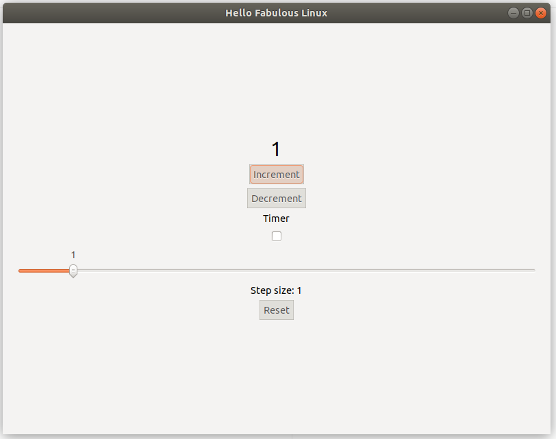
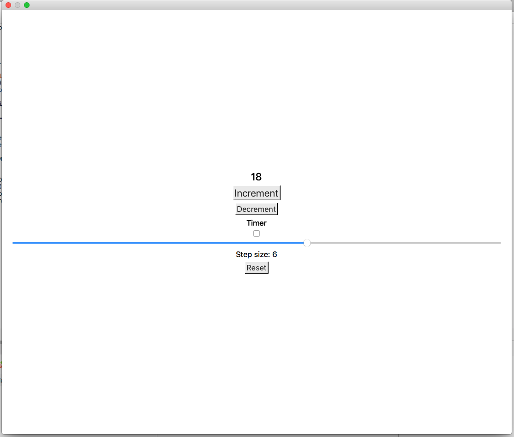

# Squeaky app for Linux

This is a version of a Fabulous app created from the [Fabulous template](https://fsprojects.github.io/Fabulous/index.html#getting-started). The difference here is this runs on Linux using GTK#.

## How to recreate this

If you want to create this yourself, follow these steps.

### Create the solution

Install the template, and create a new project using:

```sh
dotnet new -i Fabulous.Templates
dotnet new fabulous-app -lang F# -n SqueakyApp
```

Launch the solution file using [MonoDevelop](https://www.monodevelop.com) - I used the [nightly builds](https://www.mono-project.com/download/nightly/#download-lin) as these have better support for the underlying technology used by Fabulous. Then delete the `Android` and `iOS` apps.

### Creating the Linux app

* Right-click on the solution and select _Add -> Add New Project..._. Choose _Other -> .NET -> Gtk# 2.0 project_. Select __F#__ from the drop down, then click __Next__. Give your project a name, such as `SqueakyApp.Gtk`, then click __Create__.

* Add the __Xamarin.Forms__ and __Xamarin.Forms.Platform.GTK__ NuGet packages to this project, and update the Xamarin.Forms package used by the _SqueakyApp_ .NET Standard project to the same version as you have just installed.

* Add a reference to the _SqueakyApp_ .NET Standard project to your new GTK project.

* Open up `Main.fs`, and change the code to match the following:

    ```fsharp
    namespace SqueakyApp.Gtk
        module Main =

            open System
            open Xamarin.Forms
            open Xamarin.Forms.Platform.GTK

            [<EntryPoint>]
            let Main(args) =
                Gtk.Application.Init()
                Forms.Init()

                let app = new SqueakyApp.App()
                let window = new FormsWindow()
                window.LoadApplication(app)
                window.SetApplicationTitle("Hello Fabulous Linux")
                window.Show();

                Gtk.Application.Run()
                0
    ```

    This code will initialize GTK, initialize Xamarin.Forms, then launch the Forms app inside a GTK window.

* Run your app!

    

You can read more on adding Xamarin.Forms GTK support for Linux on [docs.microsoft.com](https://docs.microsoft.com/en-us/xamarin/xamarin-forms/platform/gtk/?WT.mc_id=fabulouslinux-github-jabenn).


### Creating the Mac (Cocoa) app

* Right-click on the solution and select _Add -> Add New Project..._. Choose _Mac -> App -> Cocoa App_. Select __F#__ from the drop down, then click __Next__. Give your project a name, such as `SqueakyApp.Mac`, then click __Create__.

* Add the __Xamarin.Forms__, __Fabulous.Core__, __Fabulous.LiveUpdate__ and __Newtonsoft.Json__ NuGet packages to this project, and update the Xamarin.Forms package used by the _SqueakyApp_ .NET Standard project to the same version as you have just installed.

* Add a reference to the _SqueakyApp_ .NET Standard project to your new GTK project.

* Open up `Main.fs`, and change the code to match the following:

    ```fsharp
    namespace SqueakyApp.Gtk
        open System
        open AppKit

        module main =
            [<EntryPoint>]
            let main args =
                NSApplication.Init ()
                NSApplication.SharedApplication.Delegate <- new AppDelegate();
                NSApplication.Main (args)
                0
    ```

    This code will initialize app delegate that will run the Mac app. Here is app delegate code.

    ```fsharp
    open System
    open Foundation
    open AppKit
    open Xamarin.Forms
    open Xamarin.Forms.Platform.MacOS

    [<Register ("AppDelegate")>]
    type AppDelegate () =
        inherit FormsApplicationDelegate ()

        let mutable _window : NSWindow = null
        do
            let style = NSWindowStyle.Closable |||  NSWindowStyle.Resizable ||| NSWindowStyle.Titled
            let rect = CoreGraphics.CGRect(200., 1000., 1024., 768.)
            _window <- new NSWindow(rect, style, NSBackingStore.Buffered, false)
            _window.Title <- "Hello Fabulous Mac!"
            _window.TitleVisibility <- NSWindowTitleVisibility.Hidden

        override this.MainWindow =
            _window

        override this.DidFinishLaunching(notification) =
            Forms.Init()
            this.LoadApplication(new SqueakyApp.App())
            base.DidFinishLaunching(notification)
    ```

    This code will initialize cocoa app, initialize Xamarin.Forms, then launch the Forms app inside a cocoa app window.

* Run your app!

    

You can read more on adding Xamarin.Forms Cocoa support for Mac on [docs.microsoft.com](https://docs.microsoft.com/en-us/xamarin/xamarin-forms/platform/mac).
